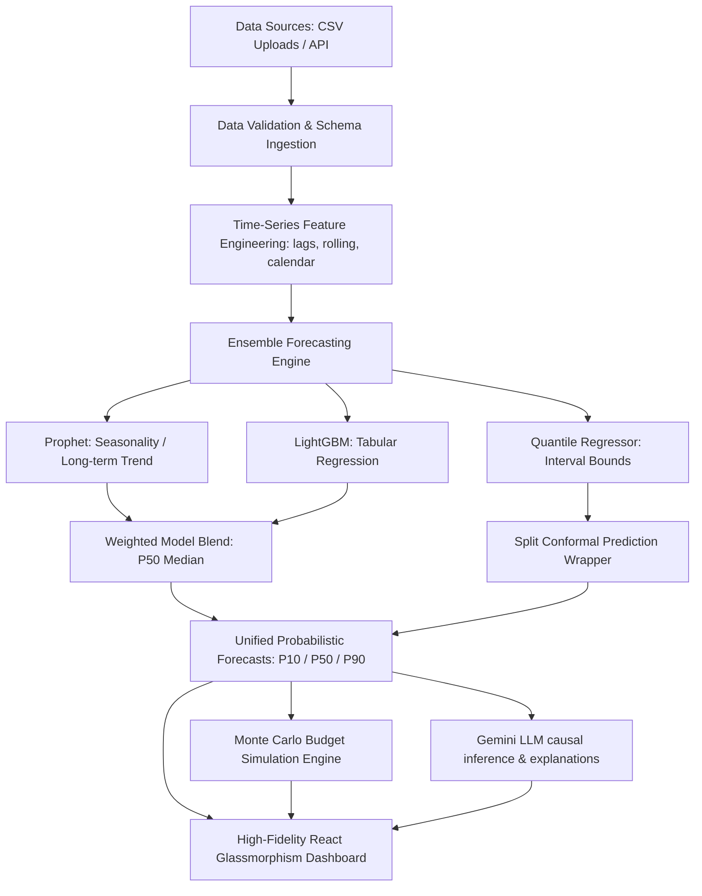

# NetElixIQ AI
================

> **Predict. Simulate. Optimize.**  
> AI-powered Time-Series Decision Intelligence Platform for Multi-Channel E-commerce Agencies.  
> *Developed for the AIgnition 3.0 Hackathon.*

---

## 1. Project Overview & Business Case

### The Problem
Marketing directors and e-commerce agencies manage large advertising spends across fragmented platforms (Google, Meta, Microsoft, Shopify, GA4). Traditional dashboards show *what happened*, but fail to explain *why* or predict *what will happen*. Decisions are made on naive linear extrapolations or guesses.

### The Solution: Probabilistic Forecasting
NetElixIQ AI bridges the gap between raw web analytics and executive decisions. Rather than presenting a single point forecast (which is almost always wrong), NetElixIQ AI models **probabilistic forecast ranges** ($P_{10}$ Pessimistic, $P_{50}$ Median Expected, $P_{90}$ Optimistic) using a dual-model ensemble (LightGBM + Facebook Prophet) wrapped with **conformal prediction intervals**. This guarantees 80% coverage intervals, helping agencies:
1. **Model downside risk** ($P_{10}$) to protect base operating capital.
2. **Identify volatile channels** and detect optimization anomalies.
3. **Simulate budget shifts** across 2,000 Monte Carlo scenarios to maximize Blended Return on Ad Spend (ROAS).

---

## 2. Platform Architecture



---

## 3. Core Innovations Actually Implemented

- **Unified Ingestion Engine**: Automatically maps and normalizes raw reports from Google Ads, Meta Ads Manager, Microsoft Ads, Shopify reports, and GA4 datasets without strict templates.
- **Conformalized Uncertainty Calibration**: Implements split conformal relative prediction bounds. The $P_{10}$ and $P_{90}$ uncertainty bands adapt dynamically to volatility while enforcing monotonic constraints ($P_{10} \le P_{50} \le P_{90}$).
- **Monte Carlo Budget Simulator**: Performs 2,000 iterations to predict revenue and blended ROAS under variable channel-spend scenarios using historical elasticity coefficients.
- **Marketing Copilot**: Conversational multi-turn Gemini assistant loaded with campaign context, allowing natural-language queries.
- **Executive PDF Exporter**: Instant report generation detailing forecasting metrics, risk warnings, and campaign contributions.

---

## 4. Repository Structure

```
.
├── backend/                  # FastAPI Application
│   ├── api/                  # API endpoints (ingest, forecast, simulate, copilot)
│   ├── services/             # Core logic (parsers, forecasting, budget simulator)
│   └── tests/                # Pytest unit and integration suite
├── data/
│   └── sample/               # Pinned CSV sample datasets
├── frontend/                 # React (Vite) Application
│   ├── src/
│   │   ├── components/layout/ # Layout, custom SVGs, navbar, brand logo
│   │   ├── design/           # Global tokens (fonts, themes, layout system)
│   │   ├── pages/            # Landing, Dashboard, Forecast, Simulator, Copilot, Reports, Settings
│   │   └── services/         # Client API service wrappers
│   └── package.json          # Node dependencies
├── pickle/
│   └── model.pkl             # Pre-trained forecasting pipeline artifact (committed)
├── scripts/
│   ├── predict.py            # Main CLI prediction pipeline script
│   └── train_model.py        # Model fit/serialization script
├── run.sh                    # Hackathon pipeline entry point (POSIX shell)
├── requirements.txt          # Python dependency bounds (pinned)
└── README.md                 # Technical documentation
```

---

## 5. Technical Stack

- **Frontend**: React (Vite), Framer Motion (premium animations), Recharts (data visualizations), Lucide-React (vector iconography), CSS custom properties (light/dark glassmorphism theme overrides).
- **Backend**: FastAPI (lifespan managed, async routes), Uvicorn, SQLite, SQLAlchemy 2.0 (declarative schema models), Pydantic v2 (type validation).
- **ML & Data Science**: Pandas, NumPy, Scikit-Learn, LightGBM (Gradient Boosting Regression), Facebook Prophet (Additive Regressive Time-series), CmdStan (Stan C++ Optimizer), Conformal wrappers.

---

## 6. Setup & Installation

### Prerequisites
* Operating Systems: Linux, macOS, Windows (PowerShell/WSL)
* Python version: `3.11` to `3.13`
* Node.js version: `18.0+`

### 1. Backend & CLI Installation
Clone the repository, initialize environment variables, and install dependency layers:
```bash
# Clone
git clone https://github.com/SriDesiyan/NetelixIQ-AI.git
cd NetelixIQ-AI

# Install Python requirements
pip install -r requirements.txt
```

### 2. Run automated validation (run.sh)
The submission pipeline runs predictions on the committed serialized model with zero internet access, retraining, or interaction:
```bash
chmod +x run.sh
./run.sh ./data/sample ./pickle/model.pkl ./output/predictions.csv
```
This writes the forecasted 30, 60, and 90-day probabilities to the `output/predictions.csv` spreadsheet.

### 3. Local Development Servers
To run the full interactive web application locally:

#### Step A: Configure Environment
Copy the example variables file:
```bash
cp .env.example .env
```
*(Optional)* Insert your `GEMINI_API_KEY` to activate real-time LLM explanations. If blank, fallback mock analytics are served.

#### Step B: Start Dev Servers
* **On Linux / macOS**:
  ```bash
  chmod +x start.sh
  ./start.sh
  ```
* **On Windows (PowerShell)**:
  ```powershell
  .\run.ps1
  ```

Once active:
* **Frontend Application**: `http://localhost:3000`
* **FastAPI Swagger Docs**: `http://localhost:8000/docs`

---

## 7. Forecasting Methodology

### Feature Engineering
The pipeline aggregates incoming datasets into a single daily time series of `spend`, `impressions`, `clicks`, `conversions`, and `revenue`. It engineers 39 lag, rolling-average, and calendar indicators:
* **Rolling windows**: 7-day, 14-day, and 28-day averages tracking volatility.
* **Lags**: 1-day, 7-day, and 14-day offsets representing trend momentum.
* **Calendar seasonality**: Day-of-week binary states and month indicators.

### Ensemble Blending & Conformal Intervals
- **Point Prediction ($P_{50}$)**: Blends predictions from LightGBM (tabular lags) and Prophet (trend/weekly seasonality), weighted dynamically by their inverse out-of-fold MAPEs.
- **Uncertainty Bounds ($P_{10}$ / $P_{90}$)**: Conformalizes the point predictions using split conformal prediction relative bounds calibrated on the validation set residuals. This establishes mathematically sound margins proportional to the forecast level, capped at a maximum 60% error rate.

---

## 8. API Reference Documentation

### `POST /api/ingest/upload`
Uploads a single channel CSV file.
- **Parameters**: `channel` (query string), `file` (multipart form)
- **Response Example (`200 OK`)**:
  ```json
  {
    "status": "success",
    "session_id": "sess_8g7d2m1s",
    "filename": "google_ads.csv",
    "rows_ingested": 480
  }
  ```

### `GET /api/forecast/generate`
Generates probabilistic forecast arrays.
- **Parameters**: `session_id`, `horizon` (30, 60, 90), `target` (revenue, spend, roas)
- **Response Example (`200 OK`)**:
  ```json
  {
    "forecast": [
      { "date": "2026-07-20", "p10": 8010.50, "p50": 8500.00, "p90": 9015.50 }
    ],
    "summary": { "total_p50": 254161.00, "model_mape": 0.1013 },
    "confidence": 0.694
  }
  ```

---

## 9. Testing & Reproducibility
We run a comprehensive suite of unit and integration tests covering data parsers, model serializations, and mock endpoint responses:
```bash
python -m pytest backend/tests/ -v
```

### Reproducibility Standards
- **Deterministic**: Fixed random seeds in LightGBM and Stan guarantee identical outcomes.
- **Offline Capable**: Pipeline runs complete local validation without hitting third-party APIs.
- **Zero Retraining**: Deserializes the full ensemble state, eliminating slow fitting compilations during prediction.

---

## 10. License & Authors

* **License**: MIT License
* **Authors**: SriDesiyan (Product Architect & Lead Engineer) and the NetElixIQ AI Team.

TEAM NAME: TECH AVERIX
COLLEGE: CHENNAI INSTITUTE OF TECHNOLOGY
TEAM MEMBERS: SRI DESIYAN V , Mohamed Ismail A
